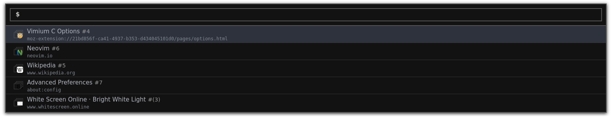

# A dark theme for Vimium C  

A very simple and pleasant theme for the Vimium C VomniBar inspired by the very helpful [Darukutsu/vimiumc-themes](https://github.com/Darukutsu/vimiumc-themes).

To install open Vimium C settings and paste the [theme](./vimium-c-theme.css) into the `Custom CSS for Vimium C UI` section.
